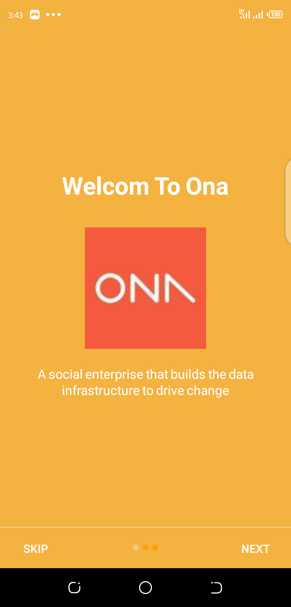
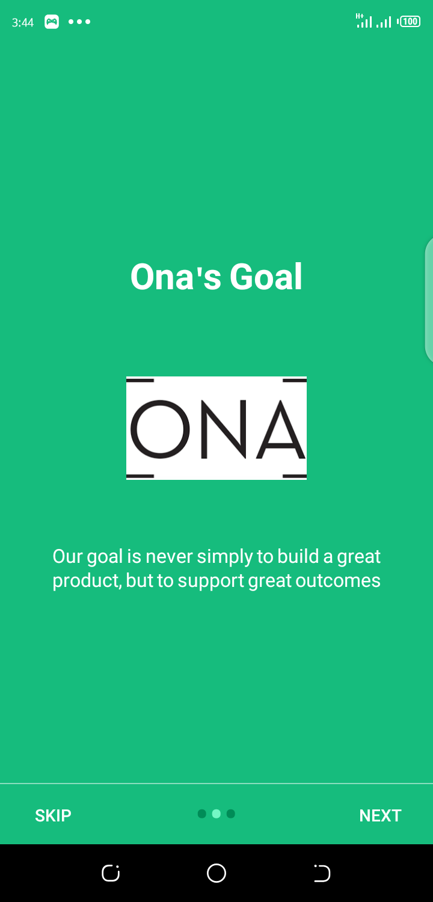
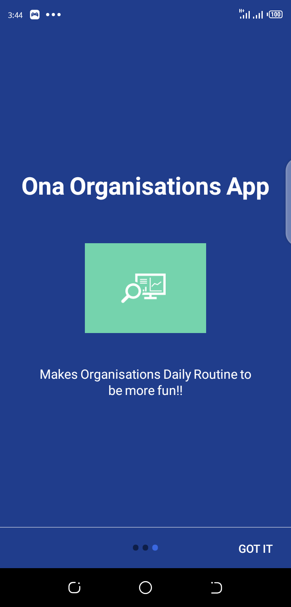
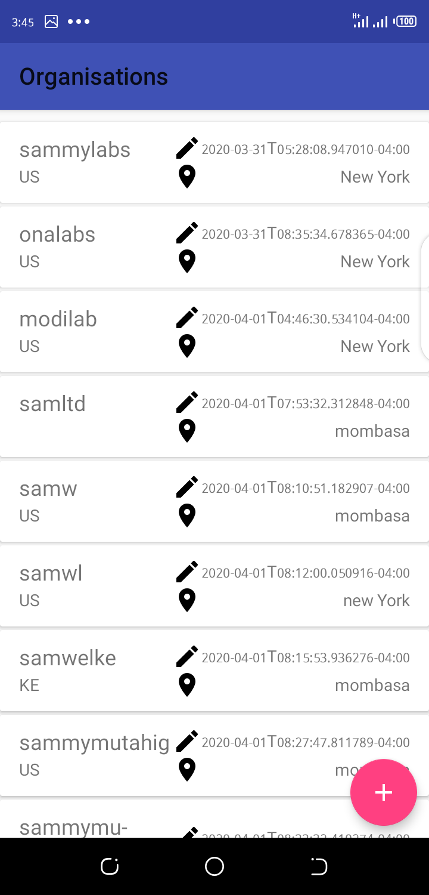
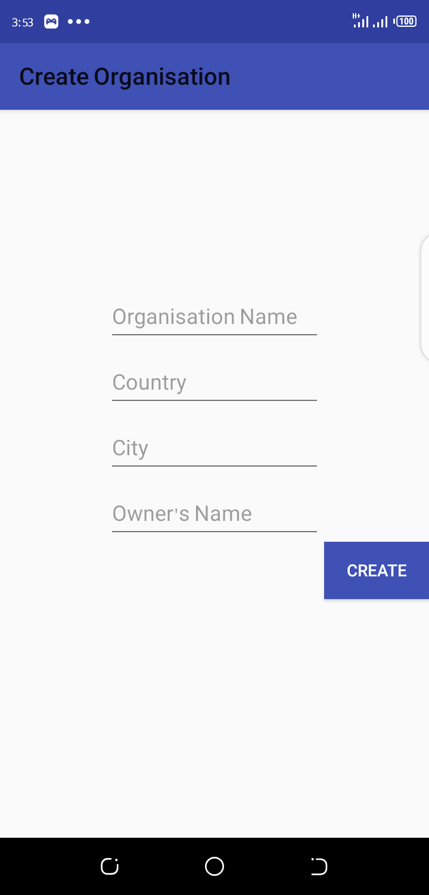
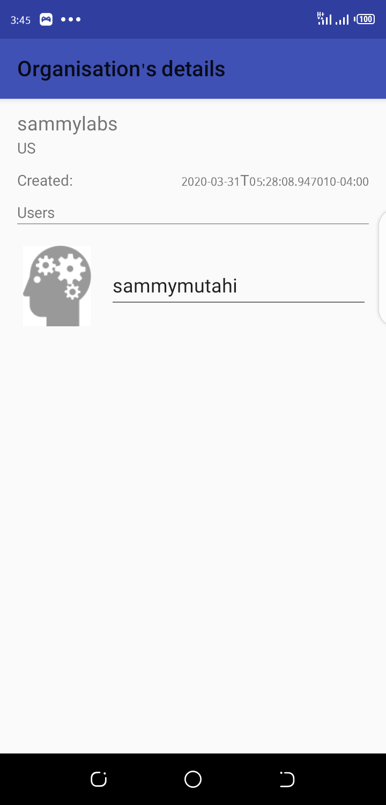

# Ona Organisations App       

Ona organisations app is a simple app that provides ease of accessability and usage of ona restful services.

The app uses the **MVP Architecture**. I have used the following components for development:

* Dependency Injection - Dagger2
* Presenter - Handles the views
* ViewModel - Manage your UI's data in a lifecycle-aware fashion
* DataBinding -  minimize the glue code necessary to bind your application logic and layouts.

## Prerequisites
You will need the following to run this project:
1. A laptop or desktop machine with internet access
2. Android Studio 3.1 Stable Channel (Latest Stable Release)

## Setting Up
* Clone the Repository from Github
* Open the project folder using Android Studio IDE

### Welcome Screen
The User will the be presented with the welcome page, where they will be presented with info about ona,ona goals and what the 
app does.
          

### Main Dashboard 
After welcome page, the use is redirected to the Main Dashboard Page, which is the Main Activity in our application. The Dashboard shows organisations, and gives the User the options to:

* Add New Organisation via + button

This is how the Dashboard looks like:

### Organisations [Add -> create] 
The User is required to add organisation, using the Add button option on the Main Dashboard. This is how the process looks like :

   

### Organisation's Details Page
This page shows the organisation's Details in an easy to understand way! Just click on the organisation's card 

    
 

### Undone Parts
* Not done all Unit Tests
* No Log in page(the app currently use my api_token key)
* No charts implented

